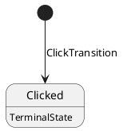
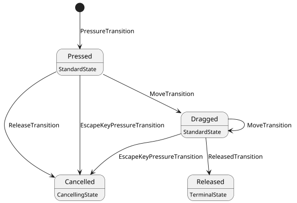

[](https://ci.inria.fr/malai/job/malai_typescript/) 
# MalaiTS :
The TypeScript implementation of [Malai](https://github.com/arnobl/Malai).

# How to install

As an npm package, just add org.malai.ts to your dependencies.

```json
{
"org.malai.ts": "latest"
}
```

# How to use

MalaiTS help you to easily bind command to the widgets of your HTML UI (button, textbox, div...).

We provide several functionality to do that :

## User Interaction :

We provide a lot of built-in User Interaction :
* Press a BoxCheck
* Press a button
* Choose in a selection (ChoiceBoxSelected)
* Click on a HTML element
* Picked a color (input event trigger the interaction, not change event)
* Drag and Drop
* Double click an element
* Drag Lock
* Click on a hyperlink
* Press a key on the keyboard
* Press and release a key on the keyboard (KeyTyped)
* Press a menu button (WIP, see [\<menu\>](https://developer.mozilla.org/en-US/docs/Web/HTML/Element/menu))
* Press one of the mouse button
* Scroll the document
* Change the value of a spinner
* Type a text (TextInputChanged)

An user interaction is basically a [FSM](https://en.wikipedia.org/wiki/Finite-state_machine).

For example the FSM of Click is :


and the FSM of Drag and Drop is :


## Binder :

The binders are the main purpose of [Malai](https://github.com/arnobl/Malai), it the system that help you build your interface. The binder possess two main element :
* the binder  , like ButtonBinder or ColorPickedBinder (one Binder for each interaction WIP)
* the bind() routine, that must be used to make the binder work

example :
``` typescript
nodeBinder<InteractionData, CommandeExecuted, Interaction>(i => new CommandeExecuted(i.getSomething)).on(target).bind()
```
(The function nodeBinder is a shortcut to help create the binder)

In this example, the node binder bind the user interaction "Interaction" with the HTML element "target".
